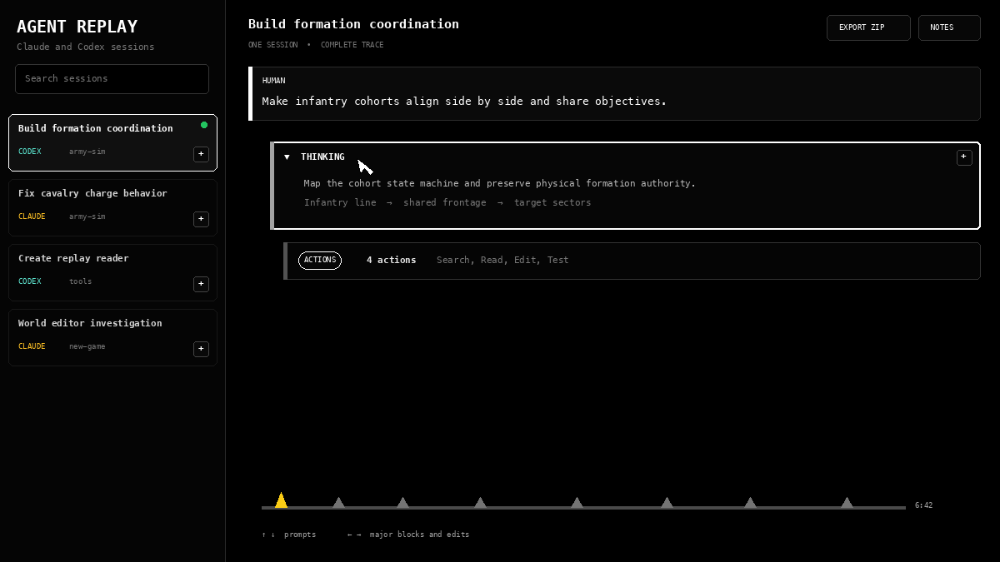

# Agent Replay Library

Agent Replay Library turns local Claude Code and Codex sessions into one searchable browser library. Each session opens as a single top-to-bottom trace with readable prompts, thinking, commands, diffs, notes, saved reading positions, and ZIP export.



## What it does

- Finds Claude Code sessions under `~/.claude/projects` and Codex sessions under `~/.codex/sessions`
- Combines Claude subagent logs into their parent session in chronological order
- Uses one browser tab with a persistent session rail
- Separates thinking, action groups, commands, code edits, and Markdown edits
- Keeps human prompts and thinking readable while actions begin collapsed
- Preserves scroll position, open sections, notes, and reading markers across live updates
- Adds notes to sessions, turns, thinking blocks, action groups, edits, and long sections
- Searches the complete session and opens collapsed content around each result
- Exports a self-contained replay ZIP with comments and raw transcripts
- Runs locally at `http://127.0.0.1:7331`

## Install on macOS

Node.js 18 or newer and npm are required.

```bash
git clone https://github.com/syedAbbas-CLPR/agent-replay-library.git
cd agent-replay-library
chmod +x install.sh
./install.sh
```

The installer adds `claude-replay` 0.11.0, applies the reader extensions, installs a login service, and opens the library. It does not upload session data.

Run the checks at any time:

```bash
./scripts/doctor.sh
```

Remove the local service and launchers:

```bash
./uninstall.sh
```

Uninstalling leaves Claude and Codex session logs and browser notes untouched.

## Reading controls

| Control | Behavior |
| --- | --- |
| Up and Down | Previous or next human prompt |
| Left and Right | Previous or next major trace block |
| Sideways on an action group | Opens the group, then visits its file edits one at a time |
| Command F | Search the complete session |
| Space | Play or pause the original replay |
| Plus button | Add a note to that session or section |

The bottom timeline draws one raised peak for every human prompt. Upcoming prompts are grey, passed prompts are white, and the current prompt is yellow.

Clicking a prompt peak or manually scrolling resets the keyboard navigation anchor. The next arrow command continues from the visible prompt or trace position instead of returning to an older location.

## Sharing a replay

Open a session and choose `EXPORT ZIP`. The download contains:

- `replay.html`, which opens without the server
- `COMMENTS.md`
- `comments.json`
- `manifest.json`
- the main JSONL transcript
- merged Claude worker logs when present

The exported transcript can include source paths, prompts, command output, and other information captured by the coding agent. Review it before sharing.

## What happens when a chat is cleared

The library never deletes chats. It rescans the local Claude and Codex JSONL directories every five seconds.

If the agent keeps the original JSONL file, the replay remains in the library. A new log appears as a new session. If the source JSONL is physically deleted, its session disappears from the library. An exported ZIP remains independent of the source log.

## How it is installed

The service runs through a macOS LaunchAgent named `com.local.agent-replay-library`. Its files live in:

```text
~/.local/share/agent-replay-library
~/.local/bin
~/.config/claude-replay
~/Library/LaunchAgents/com.local.agent-replay-library.plist
```

The browser UI stores notes and reading state in local storage. The server binds only to `127.0.0.1`.

## Project layout

```text
src/server.mjs                 local session library and export server
src/overrides/player.html     customized replay reader
src/overrides/codex.mjs       Codex event parser
src/overrides/claude-replay.mjs command-line integration
config/high-contrast.json     black and white reader theme
bin/                          local launch commands
scripts/doctor.sh              installation diagnostics
scripts/make_demo.py           demo GIF generator
```

## Credits and license

This project builds on [claude-replay](https://github.com/es617/claude-replay). See [NOTICE.md](NOTICE.md) for attribution. The included software is distributed under the MIT license.
